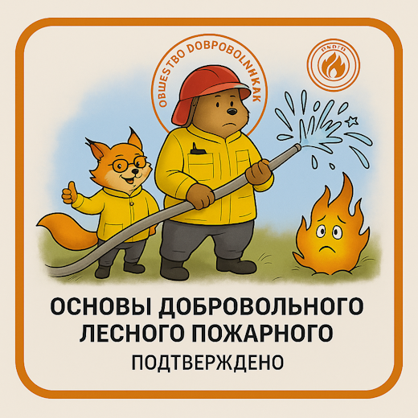

# Бейдж: "Основы ДЛП"

## Основная информация

**Полное название**: Основы добровольного лесного пожаротушения  
**Код бейджа**: `odlp-foundation-basics-specialist-2025`  
**Категория**: Foundation (Основы)  
**Уровень сложности**: Базовый  
**Статус**: Обязательный для всех волонтеров  

## Описание достижения

Бейдж "Основы ДЛП" подтверждает освоение фундаментальных знаний о лесных пожарах, работе "Общества добровольных лесных пожарных" и базовых навыков пожарной безопасности. Это первый и обязательный шаг для всех волонтеров ОДЛП.

### Ценность бейджа
- **Для волонтера**: Официальное подтверждение готовности к участию в деятельности ОДЛП
- **Для ОДЛП**: Гарантия базовой подготовки участника
- **Для общества**: Повышение уровня подготовки лесопожарных добровольцев

## Критерии получения

### Образовательные требования

#### 1. Онлайн-обучение (обязательно)
- **Прослушивание 6 онлайн-занятий**:
  1. Проблема пожаров и как ОДЛП её решает
  2. Основы тактики тушения ландшафтных пожаров  
  3. Оборудование для тушения ландшафтных пожаров
  4. Техника безопасности на пожарах и по дороге к ним
  5. Радиосвязь и ориентирование
  6. Как можно вместе с ОДЛП помогать бороться с пожарами

- **Выполнение 5 практических заданий** по темам:
  - Проблематика ландшафтных пожаров
  - Тактика тушения
  - Техника безопасности  
  - Радиосвязь и ориентирование
  - Оборудование для тушения

#### 2. Практическое обучение (обязательно)
- **Участие минимум в 1 практическом занятии** с отработкой навыков работы с:
  - Ранцевым лесным огнетушителем (РЛО)
  - Мотопомпой и рукавной линией
  - Воздуходувкой (при проведении весенней кампании)

#### 3. Реальный опыт (обязательно)
- **Участие в выездном мероприятии**:
  - Лагерь на Ладоге
  - Выезд на торфяник
  - Экспедиция
  - Тренировочный день
  - Другое профильное мероприятие ОДЛП

### Альтернативный путь: Самоподготовка

#### Теоретическая часть
Изучение тем на сайте ОДЛП с прохождением тестов (минимум 50% правильных ответов):
- Почему всё горит и кто тушит
- Основы тактики тушения ландшафтных пожаров
- Ранцевый лесной огнетушитель
- Воздуходувка
- Мотопомпа
- Пожарные рукава и арматура
- Техника безопасности
- Средства индивидуальной защиты
- Связь на пожаре
- Ориентирование

#### Практическая часть
Обязательное участие в выездном мероприятии с практической работой.

## Компетенции и знания

### Теоретические знания

#### Проблематика пожаров
- Причины возникновения ландшафтных пожаров
- Виновные в пожарах на Ладоге и СЗФО
- Отличие мифов от реальности в пожарной тематике
- Организации, занимающиеся тушением в РФ
- Роль добровольцев в борьбе с ландшафтными пожарами

#### Классификация пожаров
- Типы ландшафтных пожаров
- Особенности и различия между типами
- Стадии развития пожара
- Факторы, влияющие на поведение огня

#### Оборудование и инструменты
- Названия и назначение основного ПТВ:
  - Мотопомпа
  - Рукава и арматура
  - Ранцевый лесной огнетушитель (РЛО)
  - Воздуходувка
  - Шанцевый инструмент
- Применение оборудования на разных типах пожаров

### Практические навыки

#### Техника безопасности
- Правила ТБ на пожарах
- Правила ТБ на воде
- Правила ТБ при транспортировке
- Средства индивидуальной защиты

#### Радиосвязь
- Включение рации LPD и СВ
- Настройка каналов
- Правила ведения радиосвязи
- Порядок вызова и передачи данных
- Понимание важности поддержания связи

#### Ориентирование
- Взятие азимута на дым или объекты
- Работа с компасом и навигатором
- Понимание магнитного склонения
- Определение координат местоположения
- Форматы координат, используемые ОДЛП

#### Работа с оборудованием

**Мотопомпа:**
- Подготовка к старту
- Запуск и выключение
- Подготовка к перевозке и хранению

**Рукава:**
- Характеристики разных типов рукавов
- Сворачивание восьмеркой и в двойную скатку
- Понимание когда применять разные способы

**РЛО:**
- Подготовка к работе
- Диагностика неисправностей
- Работа гидропультом
- Использование мыла
- Подготовка к перевозке и хранению

**Воздуходувка (опционально):**
- Назначение и применение
- Правила техники безопасности
- Подготовка к работе
- Работа с хоботом
- Работа в паре

### Организационные знания
- Распределение ролей в команде
- Принцип единоначалия
- Система управления на пожаре
- Структура ОДЛП и направления деятельности

## Процесс аттестации

### Вариант 1: Организованный курс
1. **Регистрация** на курс "Основы ДЛП"
2. **Участие** в 6 онлайн-занятиях
3. **Выполнение** 5 практических заданий
4. **Посещение** минимум 1 практического занятия
5. **Участие** в выездном мероприятии
6. **Получение** подтверждения от координаторов курса

### Вариант 2: Самостоятельная подготовка
1. **Изучение** материалов на сайте ОДЛП
2. **Прохождение** тестов с результатом 50%+
3. **Участие** в выездном мероприятии
4. **Получение** подтверждения от руководителя мероприятия

### Документирование
- Ведение записей об участии в базе волонтеров
- Фиксация результатов тестирования
- Подтверждение практического опыта
- Обратная связь от инструкторов

## Срок действия и обновление

### Действительность
- **Пожизненно** — базовые знания не требуют переаттестации
- **Исключение** — существенные изменения в методологии ОДЛП

### Условия аннулирования
- Грубые нарушения техники безопасности
- Действия, дискредитирующие ОДЛП
- Решение Правления ОДЛП

## Связанные бейджи

### Предварительные требования
Отсутствуют — это входной бейдж

### Открывает доступ к
- **Опытный ДЛП** — после получения практического опыта
- **Стажер РЛО** — начало специализации по РЛО
- **Стажер воздуходувки** — начало специализации по воздуходувке  
- **Стажер рукавной линии** — начало специализации по мотопомпе
- **Другие специализированные роли** — в зависимости от интересов

### Синергия с другими бейджами
Большинство продвинутых ролей в ОДЛП требуют наличия бейджа "Основы ДЛП" как обязательного условия.

## Статистика и метрики

### Планируемые показатели на 2026 год
- **Количество получателей**: 200+ человек
- **Процент успешного завершения**: 85%+
- **Среднее время получения**: 2-3 месяца
- **Удовлетворенность процессом**: 8.5/10

### Текущая статистика (на момент запуска пилота)
- **Выдано бейджей**: 0 (пилотный запуск)
- **Зарегистрировано кандидатов**: TBD
- **Активных курсов**: TBD

---

**Эмитент**: Общество добровольных лесных пожарных  
**Дата создания бейджа**: 2025  
**Версия**: 1.0  
**Контакт для вопросов**: partner@symboltech.ru
